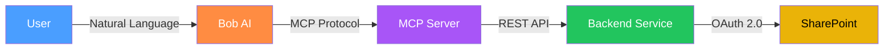
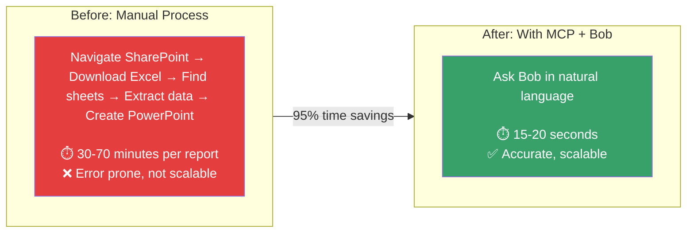
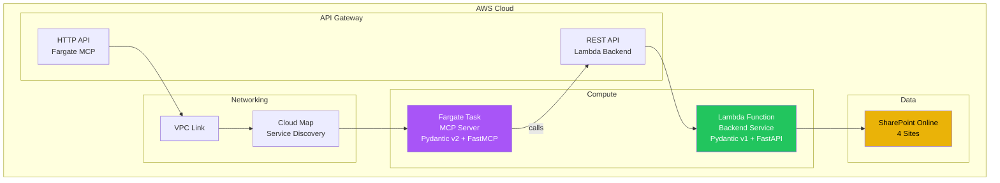
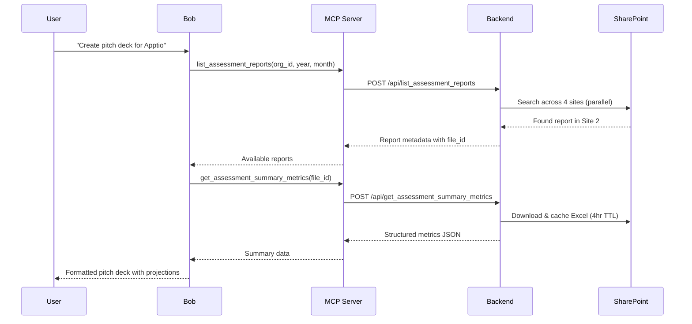
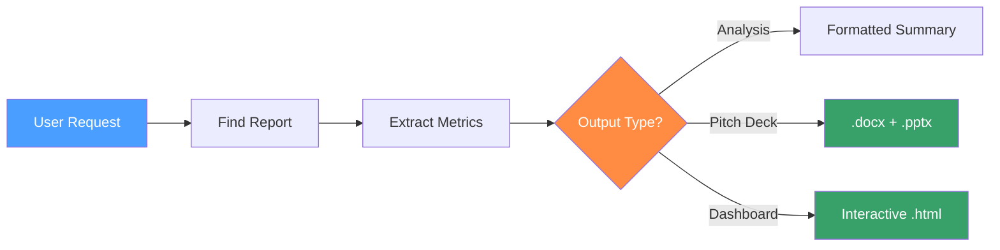
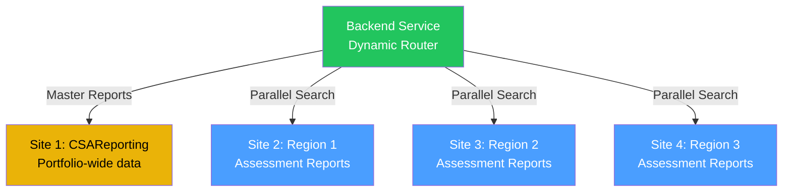

# CSA Assessment Reports MCP Server

An MCP (Model Context Protocol) server that gives Bob AI direct access to Cloudability Savings Automation (CSA) assessment reports stored in SharePoint. Sales and CSA teams can create pitch decks, analyze savings projections, and compare coverage—all through natural language.

## What It Does

Instead of manually navigating SharePoint, downloading Excel files, and extracting data across 49 sheets, users simply ask Bob:

> "Create a pitch deck for Apptio with 24-month savings projection"

Bob uses this MCP server to fetch, process, and return structured data in seconds.



## Business Value



## Architecture

The project uses a **two-service architecture** to resolve Pydantic v1/v2 dependency conflicts:



| Component | Runtime | Purpose |
|-----------|---------|---------|
| **Backend Service** | Lambda (ARM64) | SharePoint integration, Excel processing, caching |
| **MCP Server** | Fargate (ARM64) | MCP protocol handling, tool definitions, LLM communication |

## MCP Tools

### 1. `list_assessment_reports`
Find available reports by organization and time period.

```json
{
  "org_id": "113798",
  "payer_account_id": "788915724807",
  "year": 2026,
  "month": 5
}
```

### 2. `get_assessment_summary_metrics`
Extract executive summary with key metrics, savings opportunities, and recommendations.

```json
{
  "file_id": "01XXXXXXXXXXXX"
}
```

### 3. `get_assessment_sheet`
Retrieve any of the 49 sheets with pagination support (up to 5000 rows/page).

```json
{
  "file_id": "01XXXXXXXXXXXX",
  "sheet_name": "compute_usage.csv",
  "page": 1,
  "page_size": 1000,
  "format": "csv"
}
```

### 4. `get_assessment_sheet_names`
List all available sheet names in a report before fetching data.

```json
{
  "file_id": "01XXXXXXXXXXXX"
}
```

### 5. `get_master_report_summary`
Get consolidated data across multiple payer accounts.

```json
{
  "file_id": "01XXXXXXXXXXXX",
  "category": "Cat5 EC2>$40M"
}
```

### 6. `parse_sharepoint_url`
Parse SharePoint URLs (sharing links or direct) to extract file IDs for other tools.

```json
{
  "url": "https://company.sharepoint.com/sites/site/file.xlsx",
  "return_type": "metadata"
}
```

## Bob Integration

This MCP server integrates with **Bob** (IBM's AI assistant) to provide natural language access to CSA assessment data. Bob uses a dedicated skill (`csa-assessments-analyzer`) that connects to this MCP server and automates the full workflow from data retrieval to deliverable generation.



### What Bob Can Generate

Using the data from this MCP server, Bob produces:

| Output | Format | Description |
|--------|--------|-------------|
| **Executive Brief** | `.docx` | Professional Word document with savings analysis |
| **Pitch Deck** | `.pptx` | PowerPoint presentation with projections |
| **Interactive Dashboard** | `.html` | Chart.js-powered dashboard with calculators |
| **Sales Pitch** | Inline | Structured narrative with YoY breakdowns |

### Example Prompts

- *"Create a pitch deck for Apptio with 24-month savings projection"*
- *"Show flexibility analysis for a 36-month CSA engagement"*
- *"Compare current vs projected coverage for org 113798"*
- *"What sheets are available in this report?"*
- *"Generate an interactive dashboard for IBM"*
- *"What are the non-EC2 savings opportunities?"*

### Bob Workflow



### MCP Server Connection

Bob connects to the MCP server via the configured endpoint:

```json
{
  "mcpServers": {
    "csa-assessments-prod": {
      "type": "streamable-http",
      "url": "https://<http-api-id>.execute-api.us-west-2.amazonaws.com/mcp"
    }
  }
}
```

## AWS Deployment

### Infrastructure Overview

```
┌─────────────────────────────────────────────────────┐
│ API Gateway (REST)          API Gateway (HTTP)       │
│ └─ /api/{proxy+}           └─ /mcp/{proxy+}        │
│    → Lambda                    → VPC Link           │
│                                   → Cloud Map       │
│                                      → Fargate      │
├─────────────────────────────────────────────────────┤
│ VPC (Private Subnets)                               │
│ ┌─────────────┐  ┌──────────────┐  ┌───────────┐  │
│ │ Lambda ENI  │  │ Fargate Task │  │ VPC Link  │  │
│ │ (Backend)   │  │ (MCP Server) │  │ ENIs      │  │
│ └─────────────┘  └──────────────┘  └───────────┘  │
├─────────────────────────────────────────────────────┤
│ Supporting Services                                  │
│ • Cloud Map (service discovery with SRV records)    │
│ • ECR (container images)                            │
│ • CloudWatch Logs                                   │
│ • S3 (file cache bucket)                            │
└─────────────────────────────────────────────────────┘
```

### Key Configuration

| Resource | Detail |
|----------|--------|
| Lambda | Python 3.13, ARM64, 3008MB, 300s timeout |
| Fargate | 256 CPU, 512MB, ARM64, Streamable HTTP transport |
| VPC Link | Private subnets, Cloud Map service discovery |
| Cloud Map | A + SRV records for port-aware routing |
| Cache | S3 bucket with 1-day expiration |

### Deployment

```bash
# Prerequisites: AWS credentials, CodeArtifact access

# 1. Prepare dependencies (Linux ARM64 wheels)
./scripts/prepare-deployment.sh

# 2. Build and push MCP server container
./scripts/build-and-push-ecr.sh

# 3. Deploy with Serverless Framework
serverless deploy --stage dev1 --region us-west-2

# 4. Force ECS task to pull latest image
aws ecs update-service \
  --cluster csa-assessments-mcp-dev1-cluster \
  --service csa-assessments-mcp-dev1-mcp-service \
  --force-new-deployment
```

### Endpoints

After deployment:
- **Backend API:** `https://<rest-api-id>.execute-api.us-west-2.amazonaws.com/<stage>/api/health`
- **MCP Server:** `https://<http-api-id>.execute-api.us-west-2.amazonaws.com/mcp`

## Multi-Site SharePoint Architecture

The backend dynamically routes requests across 4 SharePoint sites:



- Users don't need to know which site holds their data
- Parallel queries across all assessment sites
- Automatic caching with 4-hour TTL
- Resilient — if one site is unavailable, others continue working

## Local Development

### Prerequisites

- Python 3.13+
- `uv` package manager
- Azure AD credentials for SharePoint
- Access to CloudWiry CodeArtifact

### Setup

```bash
# Backend (Pydantic v1)
cd backend && uv sync && cd ..

# MCP Server (Pydantic v2)
cd mcp && uv sync && cd ..

# Configure environment
cp .env.example .env  # Edit with your credentials

# Start both services
./start_all.sh
```

### VSCode

Open the workspace file for automatic interpreter switching between the two projects:

```bash
code assessments-mcp-server.code-workspace
```

## Project Structure

```
assessments-mcp-server/
├── backend/                     # Backend service (Lambda)
│   ├── pyproject.toml          # Pydantic v1 dependencies
│   ├── backend_service.py      # FastAPI application
│   ├── lambda_handler.py       # Lambda entry point (Mangum)
│   ├── settings.py             # Configuration
│   └── src/
│       ├── models/             # Input/output/internal models
│       ├── sharepoint/         # Client, discovery, cache
│       ├── processing/         # Excel, CSV, summary extraction
│       ├── services/           # Business logic
│       └── utils/              # Filename parsing, validators
├── mcp/                        # MCP server (Fargate)
│   ├── pyproject.toml          # Pydantic v2 dependencies
│   ├── mcp_server.py           # FastMCP tool definitions
│   ├── mcp_models.py           # Input validation models
│   └── Dockerfile              # Container image
├── scripts/                    # Deployment scripts
├── serverless.yml              # Infrastructure as Code
└── start_all.sh                # Local dev launcher
```

## Error Handling

All tools return structured error responses:

```json
{
  "error": "Report not found: invalid-id",
  "tool": "get_assessment_summary_metrics",
  "hint": "Use list_assessment_reports to find available reports."
}
```

## License

Internal use only — CloudWiry/Apptio

## Version History

- **0.1.0** (2026-06-16) - Initial implementation
  - 6 MCP tools for assessment report operations
  - Multi-site SharePoint integration with dynamic routing
  - AWS deployment on Lambda + Fargate
  - Bob AI integration via Streamable HTTP transport
